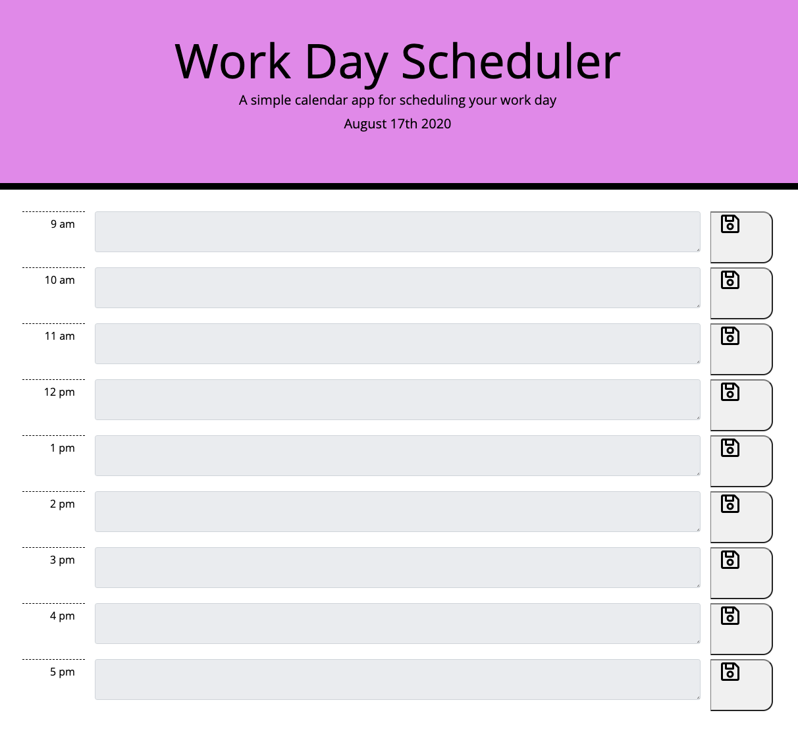

# 05 Third-Party APIs: Work Day Scheduler

Basically this project allows you to add any events between the hours of 9am and 5pm and will color code the past, present and future events you input as the day progresses.

Started by reading the documentation on how to use moment to find the exact time and date. Used this to set today's date in the header. Then I began working on the body by creating just one row through html and styling it the way I wanted. I then dove into appending the rows in a for loop with js. The trickiest part for me was definitely working with an object and storing the values in Local Storage. I had to wait overnight to double check that my clear of local storage code worked.

## Technologies

html
js
css
moment
jQuery
bootStrap
fontAwesome

## Application

Website: 
https://asegre18.github.io/hw5-work-day-scheduler/

GitHub Repo:
https://github.com/asegre18/hw5-work-day-scheduler

Screenshot of Website:
